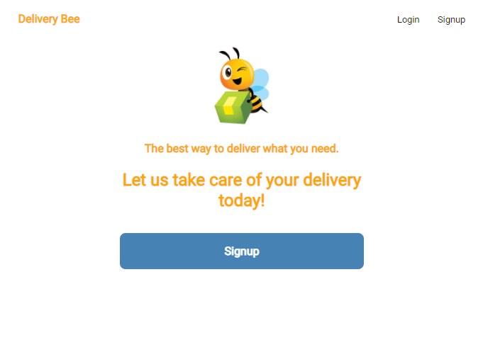
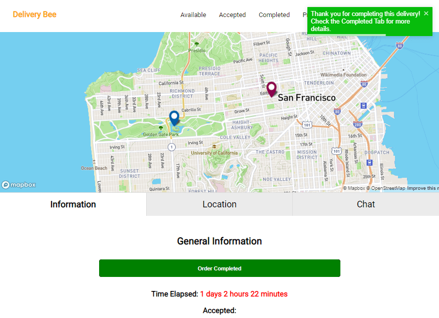
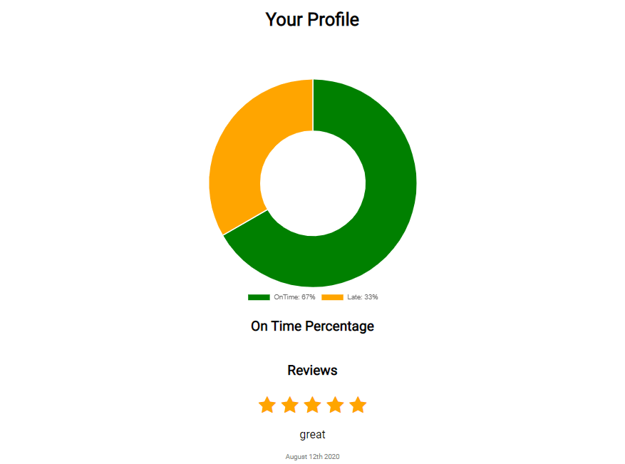
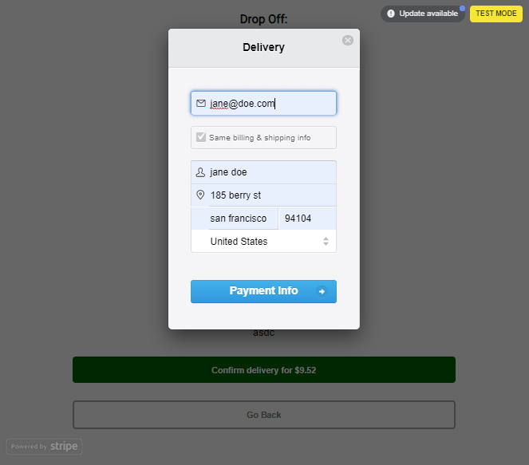

# Delivery Bee 

The Delivery Bee is a Postmates clone where customers can request deliveries, and Helper Bees fulfill the orders.
The app has a frontend for the customers and a frontend for the helpers. Delivery Bee utilizes the MapBox API to display maps and the Stripe API to take care of payments. The app uses Redux to manage state, and it also uses React Hooks, toast notifications, ChartJs, and MomentJs(format time/dates).

## Challanges

### Determining the MapBox focal point and the appropriate zoom

One of the challenges I encountered was with the appropriate zoom in the Mapbox maps. Initially, the zoom defaulted to the first pick up location pin, and it didn't consistently zoom in or out to ensure both pins could be seen and centered. I then had the idea of having a helper function zoom in on the midpoints along the longitude and latitude as the focal point. I also created another zoom helper function that zooms in or out based upon the distance between the two pinpoints.

### Notifications

I wanted to have a quick way to notify the customer or helper after specific tasks were completed without making the components too bulky. I found the react-toastify library, which simplifies toast notifications in just a few lines of code.

### Formatting time and Date

In formatting the time and dates for the order creation and completion, I used the moment-js library. The library takes care of formatting the time and dates without having to write extra unnecessary code.
